<div style='text-align:center '>
    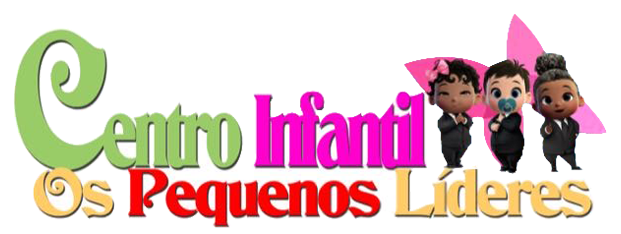<br/><br/>
    <h1>Sistema de Gestão de Recursos Humano</h1>
</div>

# Sumário

* [Introdução](#introducao)
* [Problemas](#problemas)
* [Motivação](#motivacao)
* [Objetivo Geral](#objetivo-geral)
* Descrição do Projeto
    1. [Descrição do Sistema](#descricao-do-sistema)
    2. [Tecnologias](#tecnologias)
    3. [Segurança](#seguranca)
    4. [Simulação](#simulacao)
* [Termo de uso](#termo-de-uso)
* [Conclusão](#conclusao)
* [Impacto Social](#impacto-social)
* [Recomendações](#recomendacoes)
* [Diagramas](#diagramas)
* [Anexos](#anexos)


# Introducao


O Centro infantil os Pequenos Lideres é uma creche, que foi iniciado em 2017 que tem como objetivo de
educar e controlar as crianças.

Este sistema de gestão de recursos humanos que vem ajudar no Centro de infantil tanto na gestão dos
funcionários , gestão de salários e também na gestão de crianças.
    

# Problemas


 Os problemas de gestão de recursos humanos na creche causam:
    
- A falta de controlo nós funcionários
- O custos altos em papeis
- E a perdas documentos dos funcionários e das crianças.
 

# Motivacao


As minhas motivações foram:

- A principal motivação é resolver o problema da creche
- Garantir uma boa segurança nas crianças.
- Ganhar experiência em gestão.


# Objetivo-geral


- Implementar o sistema de gestão de recursos humanos que possa resolver os problemas no centro
infantil.


# Descricao-do-sistema


Este sistema tem 4 módulos :

1. Modulo Administrador : Permite fazer o controlo dos usuários do sistema pode eliminar, editar , criar
e consultar.
2. Modulo Crianças : permite fazer o controlo das crianças da creche.
3. Modulo Pessoal : permite fazer o controlo dos funcionários da creche.
4. Modulo Salario : permite gerir o salário dos funcionários da creche.


# Tecnologias


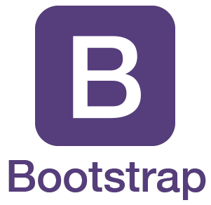


<br/>


# Seguranca


### A nível de Base de Dados:

- 3FN (Normalização) – Normalizei a base de dados para, facilitar o controlo dos dados.
- Utf8_general_ci – Permite usar caractere em maiúscula, minúscula e também com acento.


### A nível de Sistema:

- Criptografia - usei o MD5 na senha de cada usuário.
- Manipulação de string - usei no controlo das datas e dos nomes dos usuários, funcionários e das
crianças.
- Required - Para obrigar o preenchimento de alguns campos do formulário.
- Senha - Quando o usuário é novo por obrigação tem que alterar a sua senha .
- preg_match - Faz o controlo dos ficheiros do sistema.


# Simulacao

[Local da ilustração do projeto](readme/simulacao/simulacao.mp4)

<div style='text-align:center '>
    <video width="320" height="240" controls>
        <source src="movie.mp4" type="video/mp4">
        <source src="readme/simulacao/simulacao.mp4" type="video/ogg">
            Simulação do projeto
    </video>
</div>


# Termo-de-uso

```bash
# Instale:
$ XAMP ou WAMP

# Cria uma pasta com o mesmo nome do projeto,
# esta pasta deve estar dentro do servidor local
#   XAMP    |   WAMP
$ cd/htdocs |  $ cd/www

# Clona o projeto dentro da pasta que criaste.
# Abre o cmd.
$ Clone <nome do projeto>

# Importa o banco de dados no mySQL
$ cd/xamp/htdocs/CIPL/bd/cipl.sql

# Abri aplicação
$ https://localhost/CIPL/privado/admin/index.php

# Usuário | Senha
$ admin   | 1234


```


# Conclusao

Em suma este sistema pode garantir benefícios na creche uma delas são :

- Uma boa segurança.
- Um bom controlo.
- Economizar documentos digitalizados, e outros recurso matérias.


# Impacto-social

- Garantir aos pais uma boa segurança das crianças.
- Garantir uma boa organização na creche.


# Recomendacoes


Algumas recomendações que poderão tornar o programa melhor:

* Uma aplicação mobile que conecta os encarregados para conseguir ter informações dos seus filhos a
longa distância.
* Na creche implementar um Sistema de Controlo que permite a entrada dos funcionários por meio de
cartão de acesso.
* Um site que permite expandir os serviços da creche.


# Diagramas


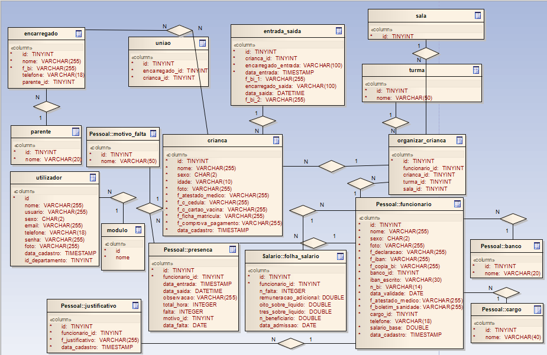
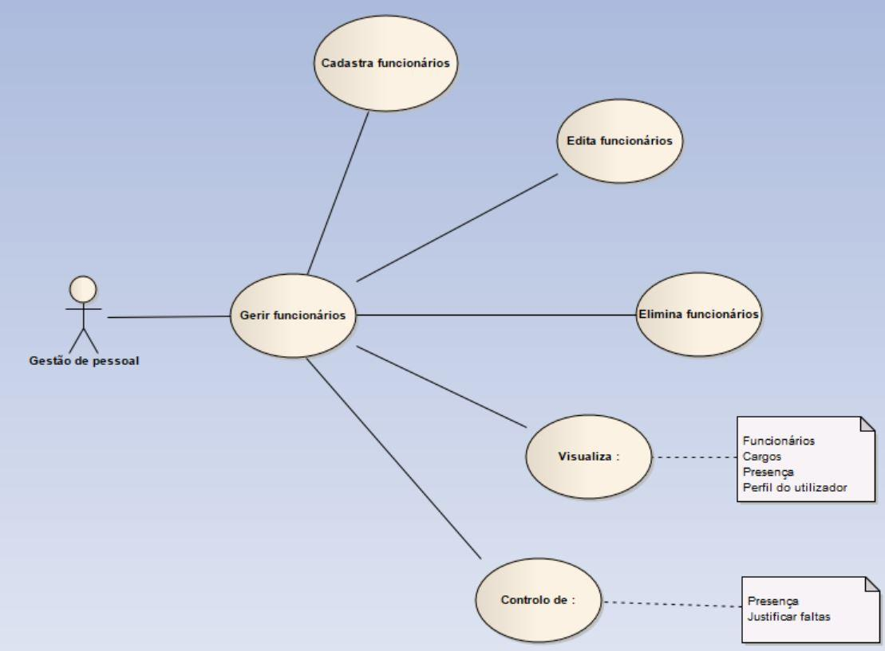
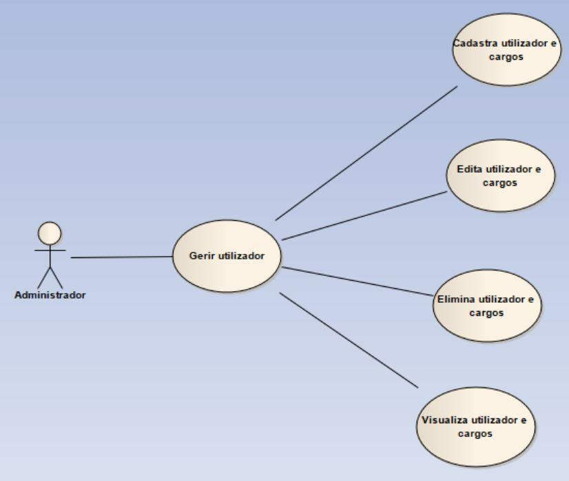

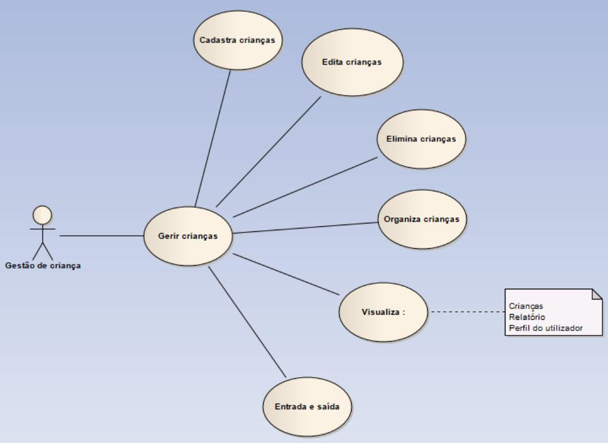

# Anexos


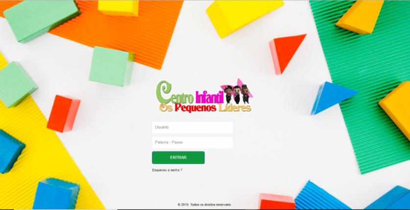


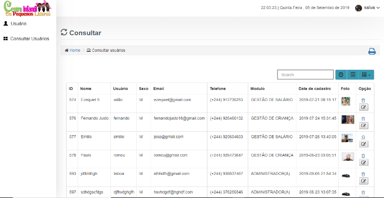

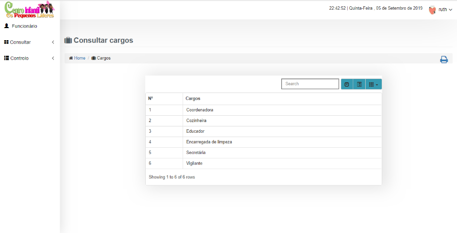

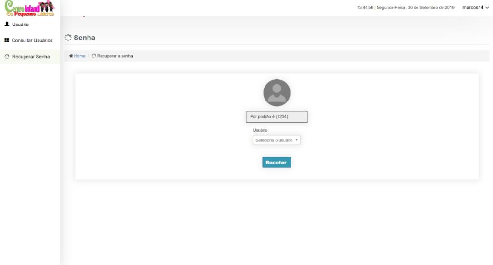
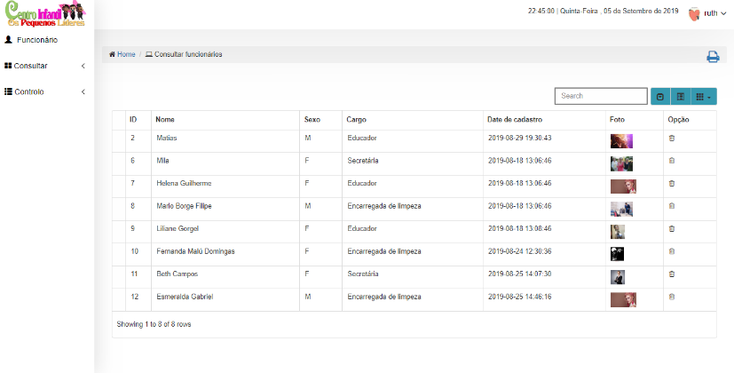
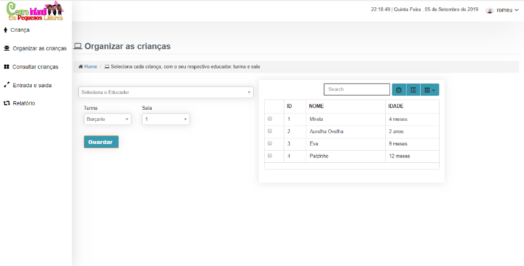
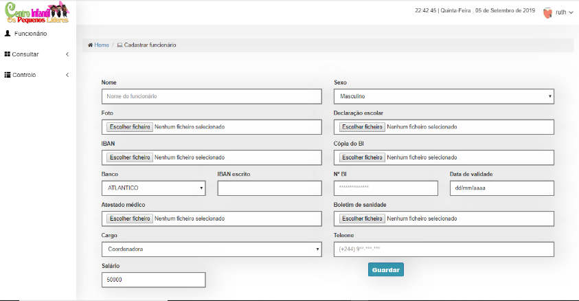


###### Autor : Aniceto Jolela 🥰
 Meu  | [Linkedin](https://www.linkedin.com/in/aniceto-jolela-076547184/))