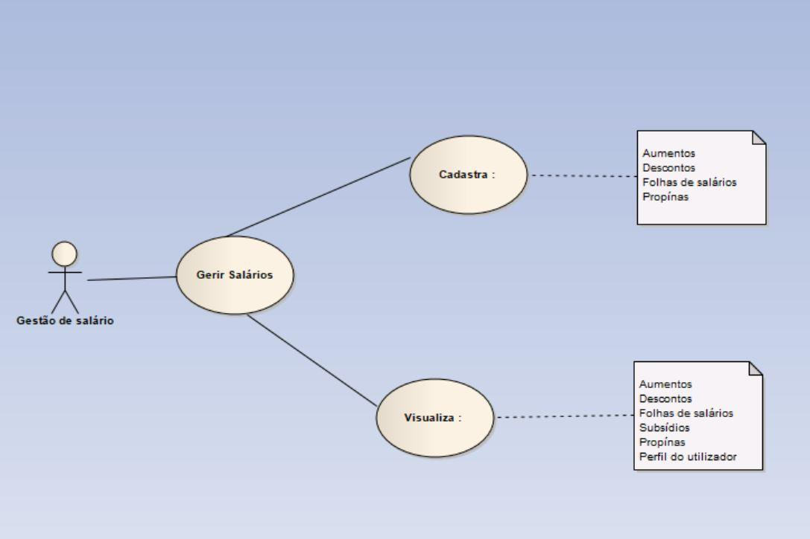
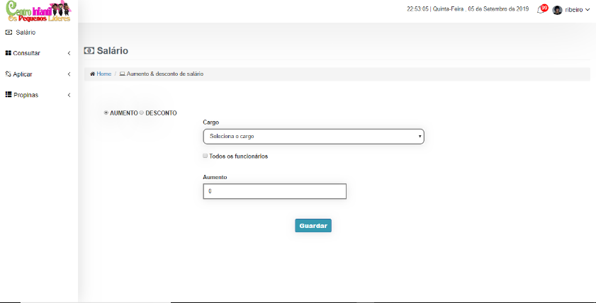
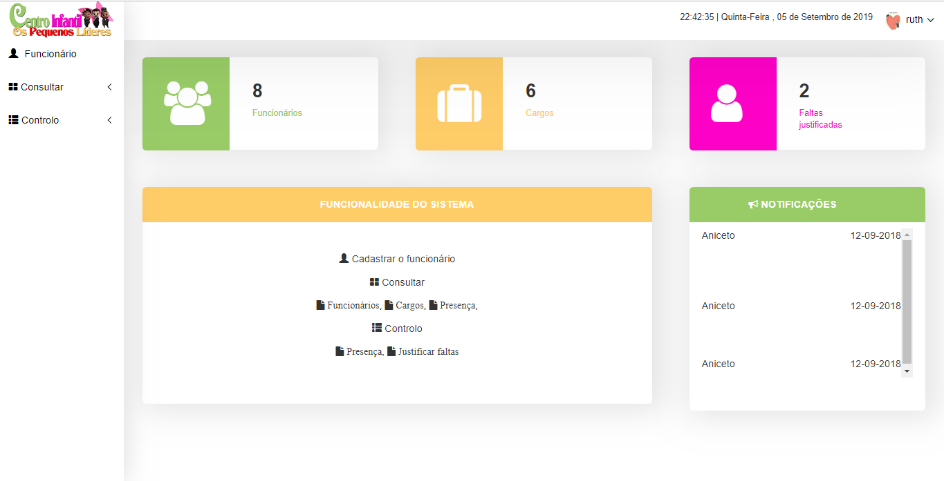

<div style='text-align:center '>
    <br/><br/>
    <h1>Human Resources Management System</h1>
</div>

# Summary

* [Introduction](#introduction)
* [Problems](#problems)
* [Motivation](#motivation)
* [Main goal](#main-goal)
* Project description
    1. [System Description](#system-description)
    2. [Technologies](#technologies)
    3. [Safety](#safety)
    4. [Simulation](#simulation)
* [Terms of use](#terms-of-use)
* [Conclusion](#conclusion)
* [Social Impact](#social-impact)
* [Recommendations](#recommendations)
* [Diagrams](#diagrams)
* [Attachments](#attachments)


# Introduction


The Centro Infantil Os Pequenos Lideres is a day care center, which was started in 2017, with the objective of educating and controlling children.

This human resources management system that comes to help in the Children's Center both in employee management, salary management and also in the management of children.
    

# Problems


Human resource management problems in the day care center cause:
    
- The lack of control by employees.
- High paper costs.
- And the loss of documents from employees and children.
 

# Motivation


My motivations were:

- The main motivation is to solve the daycare problem.
- Ensure good safety in children.
- Gain management experience.


# Main-goal


- Implement the human resource management system that can solve the problems in the children's center.


# System-Description


This system has 4 modules:


1. Administrator Module: Allows you to control system users, delete, edit, create and consult.
2. Children's Module: allows you to control the children in the nursery.
3. Personal Module: allows you to control the employees of the nursery.
4. Salary Module: allows you to manage the salary of daycare workers.


# Technologies


<br/>


# Safety


### At the Database level:

- 3NF (Normalization) – I normalized the database to facilitate data control.
- Utf8_general_ci – Allows using characters in uppercase, lowercase and also with an accent.


### At the System level:

- Encryption - I used MD5 on each user's password.
- String manipulation - used to control dates and names of users, employees and children.
-  Required - To force the completion of some form fields.
- Password - When the user is new by obligation, he has to change his password.
-  preg_match - Controls system files.


# Simulation

[Project illustration site](readme/simulacao/simulacao.mp4)

<div style='text-align:center '>
    <video width="320" height="240" controls>
        <source src="movie.mp4" type="video/mp4">
        <source src="readme/simulacao/simulacao.mp4" type="video/ogg">
            Simulação do projeto
    </video>
</div>


# Terms-of-use

```bash
# install:
$ XAMP ou WAMP

# creates a folder with the same name as the project,
# this folder must be inside the local server
#   XAMP    |   WAMP
$ cd/htdocs |  $ cd/www

# Clone the project inside the folder you created.
# Open cmd.
$ Clone https://github.com/aniceto-jolela/CIPL.git

# Import the database in mySQL
$ cd/xamp/htdocs/CIPL/bd/cipl.sql

# opened application
$ https://localhost/CIPL/privado/admin/index.php

#  User   | Password
$ admin   | 1234


```


# Conclusion

In short, this system can guarantee benefits in the nursery, one of which are:

- Good security.
- Good control.
- Save scanned documents, and other resource matters.


# Social-Impact

- Guarantee parents good safety of children.
- Ensuring good organization in the nursery.


# Recommendations


Some recommendations that could make the program better:

* A mobile application that connects guardians to get information about their children to
long distance.
* In the day care center, implement a Control System that allows the entry of employees through
access card.
* A website that allows you to expand the daycare services.


# Diagrams





# Attachments








###### Author : Aniceto Jolela 🥰
 Meu  | [Linkedin](https://www.linkedin.com/in/aniceto-jolela-076547184/))